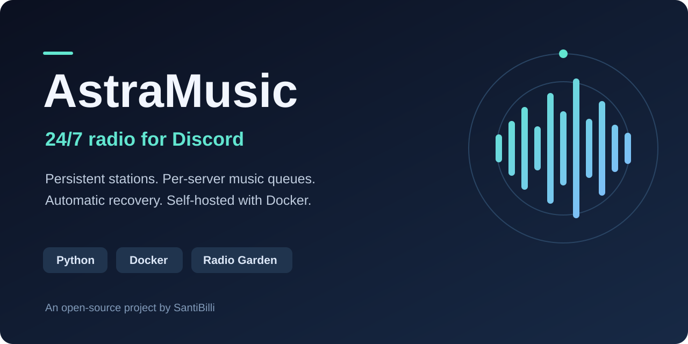

# AstraMusic

[English](README.md) · **Español**



[](https://github.com/SantiBilli/discordbot/actions/workflows/ci.yml)
[](https://www.python.org/downloads/)
[](LICENSE)

Bot de música para Discord desarrollado en Python, que podés alojar en tu propio
servidor. Reproduce videos individuales de YouTube, busca canciones de Spotify y
mantiene una emisora de Radio Garden en el canal de voz, incluso cuando todos se
van. Se despliega con Docker Compose o Dokploy.

## Funciones

- **Radio persistente:** permanece en canales vacíos y retoma la radio activa
  después de reinicios normales del contenedor o del VPS.
- **Música sobre la radio:** las canciones interrumpen la emisora; la radio vuelve cuando termina la cola.
- **Colas por servidor:** hasta 50 canciones pendientes por servidor, con estados independientes.
- **Recuperación automática:** actualiza los enlaces de transmisión y reintenta
  los cortes con esperas progresivas, hasta 60 segundos.
- **Controles de voz:** solo quienes están en el canal configurado pueden cambiar o detener la reproducción.
- **Despliegue con Docker:** contenedor sin privilegios de root, volumen
  persistente, política de reinicio y rotación de logs.

## Inicio rápido

Necesitás Docker con el plugin Compose, un servidor de Discord que puedas
administrar y tu propio token de bot. Primero seguí la
[configuración de Discord](#configuración-de-discord).

```bash
git clone https://github.com/SantiBilli/discordbot.git
cd discordbot
cp .env.example .env
```

En PowerShell, usá `Copy-Item .env.example .env` en lugar de `cp`.
Editá `.env` localmente y reemplazá el valor de ejemplo de `DISCORD_TOKEN` por tu
token. Nunca lo pegues en un issue, commit, captura o mensaje público.

```bash
docker compose up -d --build
docker compose logs -f --tail=100
```

Esperá el mensaje `AstraMusic conectado como ...`, entrá a un canal de voz común
y enviá esto en un canal de texto que el bot pueda leer:

```text
!radio https://radio.garden/listen/fm-aspen-102-3/eyipEP0m
!radio estado
```

La disponibilidad de la emisora depende del proveedor y de la ubicación de tu
servidor. No necesitás una clave de Radio Garden. Para alojamiento y
actualizaciones, consultá la [guía de despliegue](docs/deployment.es.md), también
disponible en [inglés](docs/deployment.md).

## Configuración de Discord

1. Creá una aplicación en el [Discord Developer Portal](https://discord.com/developers/applications).
2. Abrí **Bot**, obtené el token y guardalo en tu `.env` local o en el entorno del
   despliegue. Cada instalación debe usar su propia aplicación y su propio token.
3. Activá **Message Content Intent** en **Privileged Gateway Intents**. Los
   comandos usan el prefijo `!`; no hacen falta los intents de miembros o presencia.
4. En **OAuth2 → URL Generator**, elegí el scope **bot** y estos permisos:
   **View Channels**, **Send Messages**, **Connect** y **Speak**.
5. Abrí la URL generada e invitá el bot a tu servidor. No necesita permiso de
   Administrador. Revisá también los permisos específicos de cada canal.

## Comandos

Enviá los comandos en un canal de texto del servidor. Entrá al canal de voz del
bot para controlar la reproducción. Los mensajes del bot están actualmente en
español; los comandos funcionan con cualquiera de las versiones de la documentación.

| Comando | Comportamiento |
| --- | --- |
| `!p <enlace de YouTube o canción de Spotify>` | Reproduce o agrega a la cola. Alias: `!play`. |
| `!radio <enlace de emisora de Radio Garden>` | Activa o cambia la emisora de fondo y conserva las canciones. |
| `!radio estado` o `!radio` | Muestra la emisora y el estado de reproducción o recuperación. |
| `!radio off` | Desactiva la radio y conserva la cola. |
| `!skip` | Salta una canción, incluso durante su búsqueda. No salta la radio continua. |
| `!stop` | Desactiva la radio, vacía la cola y desconecta. |
| `!help` | Muestra los comandos. Alias: `!ayuda`. |

Usá un enlace de emisora con formato `https://radio.garden/listen/nombre/ID`.
Los enlaces `/visit/` de Radio Garden corresponden a ciudades y no se aceptan.

## Cómo funciona la radio

| Evento | Resultado |
| --- | --- |
| Todos salen del canal de voz | La radio continúa; no hay desconexión por sala vacía. |
| Se agrega una canción con `!p` | La radio se pausa durante la cola y vuelve cuando termina. |
| La transmisión termina o falla | Actualiza el enlace y reintenta tras 5, 10, 20, 40 y luego 60 segundos. |
| Hay un corte transitorio de voz | Intenta recuperar la conexión. |
| El contenedor o VPS reinicia normalmente | Retoma la radio guardada al conectarse a Discord. |
| Alguien desconecta al bot de voz o lo expulsa del servidor | Desactiva la radio y elimina su configuración guardada; no vuelve a entrar intencionalmente. |
| Se mueve al bot a otro canal de voz común | Guarda el nuevo destino. |
| Se usa `!radio off` | La radio permanece desactivada al reiniciar; la música pendiente continúa. |
| Se usa `!stop` | La radio permanece desactivada al reiniciar y se elimina toda la música pendiente. |

Sin radio activa, el bot se desconecta después de dos minutos sin canciones.
La configuración de radio es persistente; las colas se pierden al reiniciar el proceso.

## Configuración

| Variable | Obligatoria | Valor predeterminado / propósito |
| --- | --- | --- |
| `DISCORD_TOKEN` | Sí, para ejecutar el bot | Token de tu bot de Discord. Las pruebas no lo necesitan. |
| `RADIO_STATE_FILE` | No | `data/radio.json` localmente; Compose configura `/app/data/radio.json`. |
| `RADIO_AD_KEYWORDS` | No | Palabras completas separadas por coma; la radio se silencia mientras el título del stream (metadatos ICY) coincida con alguna. Vacío lo desactiva. Solo funciona con emisoras que identifican sus tandas. |

Compose monta el volumen `radio_data` en `/app/data`. Conservalo al desplegar.
`docker compose down` lo mantiene; `docker compose down -v` lo elimina.
Ejecutá **una sola instancia por token**. No hacen falta puertos entrantes,
dominio ni reverse proxy; Discord necesita conectividad saliente para voz.

## Limitaciones

- Spotify aporta metadatos públicos mediante oEmbed; la reproducción es una
  coincidencia buscada en YouTube, no audio de Spotify. Puede elegir otra grabación.
  No admite álbumes, playlists ni enlaces cortos de Spotify.
- YouTube admite videos individuales que no sean transmisiones en vivo. Las
  restricciones del proveedor, bloqueos regionales y videos caídos pueden impedir la reproducción.
- Radio Garden utiliza endpoints públicos sin un contrato oficial de API
  documentado. Los cambios del proveedor pueden requerir actualizar el resolver.
- Admite canales de voz comunes; no admite Stage ni comandos slash.
- La radio continua requiere un host, una conexión a Discord y una emisora
  disponibles. La recuperación automática no garantiza un servicio sin cortes.

## Uso legal y responsabilidad

AstraMusic es un proyecto de código abierto para instalar y ejecutar en
infraestructura propia. Este repositorio distribuye código fuente; no incluye
grabaciones musicales ni otorga permisos sobre contenido de terceros.

El proyecto es independiente y no está afiliado, patrocinado ni respaldado por
Discord, YouTube, Spotify o Radio Garden.

Quien instala o utiliza el software debe verificar que cuenta con las
autorizaciones necesarias para acceder, reproducir o retransmitir el contenido
elegido, y cumplir la legislación y los términos de los servicios correspondientes.
Que un contenido sea accesible mediante un enlace no implica autorización para
retransmitirlo.

El software se proporciona tal como está, con las exclusiones de garantía y
limitaciones de responsabilidad establecidas en la [licencia MIT](LICENSE), en
la medida permitida por la legislación aplicable. Los autores no controlan las
instalaciones de terceros ni avalan usos que infrinjan derechos o condiciones de
otros servicios.

La licencia MIT cubre el código del proyecto; no concede licencias sobre música,
transmisiones, marcas ni servicios externos. Este aviso no certifica el
cumplimiento legal ni reemplaza los permisos necesarios de proveedores y titulares
de derechos.

Referencias oficiales de los proveedores:

- [Términos para desarrolladores de Discord](https://support-dev.discord.com/hc/en-us/articles/8562894815383-Discord-Developer-Terms-of-Service)
- [Términos de servicio de YouTube](https://www.youtube.com/static?template=terms)
- [Términos de uso de widgets de Spotify](https://developer.spotify.com/documentation/embeds/terms)
- [Contacto de Radio Garden](https://radio.garden/settings/contact) para consultas sobre el uso del servicio.

## Desarrollo

Usá Python 3.12. Para reproducir audio localmente también hacen falta FFmpeg,
Opus y Deno; Docker los incluye. Consultá [Contributing](CONTRIBUTING.md) para
las instrucciones por plataforma.

```bash
python -m venv .venv
source .venv/bin/activate
python -m pip install -r requirements.txt
python -m unittest discover -s tests -v
```

La suite automática simula voz y proveedores externos. GitHub Actions ejecuta
las pruebas, construye la imagen Docker y revisa el historial y los archivos
versionados en busca de secretos. Para verificar audio real necesitás tu propio
servidor de pruebas en Discord.

## Documentación del proyecto

- [Despliegue y solución de problemas](docs/deployment.es.md)
- [Arquitectura y mantenimiento](docs/architecture.md)
- [Contribuciones](CONTRIBUTING.md)
- [Política de seguridad](SECURITY.md)
- [Historial de cambios](CHANGELOG.md)

## Licencia

[MIT](LICENSE) © 2026 SantiBilli. Las dependencias conservan sus propias licencias.
