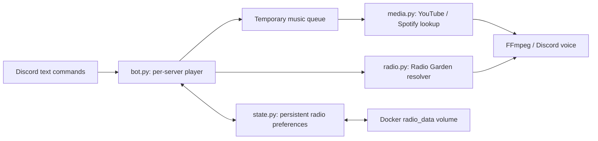

# Architecture

AstraMusic is a single-process asyncio application. One Discord bot instance
can maintain separate players for multiple servers; deployment uses one process
per token. This is not a distributed queue or a multi-replica design.

| File | Responsibility |
| --- | --- |
| `bot.py` | Commands, per-server locks/queues, worker lifecycle, cancellation, voice recovery, and radio restoration. |
| `media.py` | Music URL normalization, Spotify oEmbed lookup, and yt-dlp extraction. |
| `radio.py` | Station link normalization, metadata, stream redirects, and public destination checks. |
| `state.py` | Validated radio settings and atomic JSON persistence. |
| `tests/test_bot.py` | Music link and queue/cancellation behavior. |
| `tests/test_radio.py` | Resolution, persistence, radio/music transitions, recovery, and external removal. |

## Playback lifecycle

Each server has a player and an independent queue. Pending tracks take priority
over configured radio. When no tracks remain, the player returns to radio. With
neither tracks nor radio, it disconnects after the idle timeout.

Radio recovery refreshes the stream URL and uses an interruptible retry wait.
Commands can stop playback or interrupt resolution without waiting for the next
retry. Transient voice failures preserve radio; external removal disables it.

## Persistence

RadioStore records the canonical station share link, title, and destination
server/channel IDs. Writes use a temporary file, synchronization, and atomic
replacement. Expiring stream URLs and the music queue are not persisted.

The configured file must be writable and its containing directory persistent.
A corrupt state file is preserved and reported rather than silently replaced.
If storage fails during external removal, playback stops, but an old on-disk
setting may remain; repair storage before restarting.

## Maintenance considerations

- `RadioVoiceClient` uses `VoiceClient._connection._expecting_disconnect`, a
  private discord.py 2.7.1 flag, to distinguish internal recovery from external
  removal. Keep the version pin until compatibility is reviewed. Exercise the
  kick/internal-disconnect regression tests when changing it.
- yt-dlp and Radio Garden behavior depend on external services. Python dependency
  ranges allow updates at rebuild time; builds are not fully locked. Review
  updates, run CI, and test actual audio before deployment.
- Unit tests simulate providers and voice. They verify control flow and
  persistence, not provider uptime, voice quality, or resource capacity.
- Container execution uses a non-root user. The radio volume must remain writable
  by that user and must not be committed to Git.
